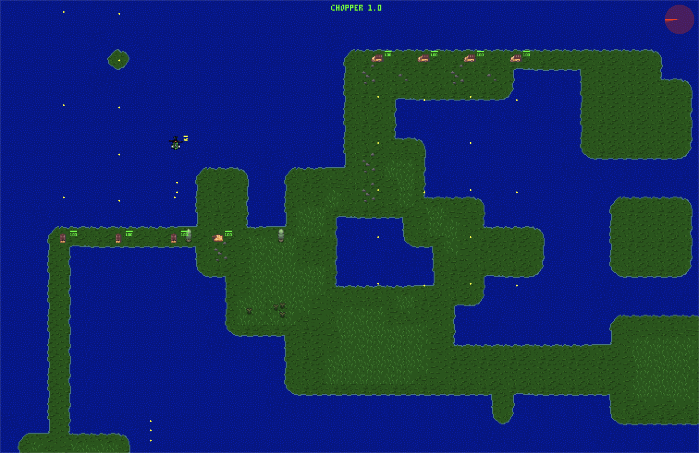

# Graduation Project - 2D Game Engine

A custom 2D Game Engine built with C++17, implementing an Entity-Component-System (ECS) architecture.



## 📂 Project Structure

* **src/**: Source code (Game loop, ECS, Components, Systems).
* **assets/**: Sprites, fonts, and tilemaps.
* **libs/**: Third-party libraries (GLM, ImGui, Lua, Sol).
* **Makefile**: Build automation script.

## 🛠 Dependencies

You need to install **SDL2** (Image, Mixer, TTF) and **Lua 5.4** to build the project.

### macOS (via Homebrew)
Make sure you have [Homebrew](https://brew.sh/) installed, then run:

```bash
brew install sdl2 sdl2_image sdl2_ttf sdl2_mixer lua
```

### Ubuntu/Debian
Install dependencies using apt:

```bash
sudo apt-get install libsdl2-dev libsdl2-image-dev libsdl2-ttf-dev libsdl2-mixer-dev lua5.4
```
